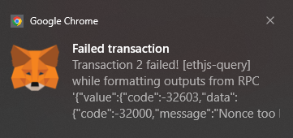
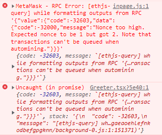
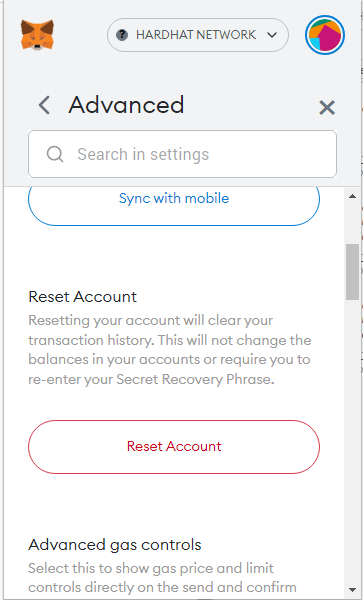

import Bleed from "nextra-theme-docs/bleed";

# Common Errors

Every once in a while when working on the your local hardhat chain, a 'Nonce too high' error will occur

<Bleed>
  

    
  

</Bleed>

<Bleed>
  

    
  

</Bleed>

The only way I've found so far to get around this error is to go into settings -> Advanced, and Reset Account.

<Bleed>
  

    
  

</Bleed>
