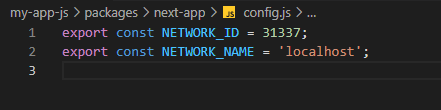

import { Code } from "../../components";
import Bleed from "nextra-theme-docs/bleed";
import Callout from "nextra-theme-docs/callout";

# Deploying Contracts

To deploy to your local hardhat environment, first start your local environment by running

<Code terminal>chain</Code>

and then in another terminal run

<Code terminal>deploy</Code>

After every deployment, a copy of the deployment (contract address and abi) is copied to the hardhat_contracts.json file in the next-app/contracts folder

When you deploy to the hardhat network, Account #0 is the owner of the contract.

<Callout emoji="⚠️">
  All 20 of the hardhat accounts created in your local hardhat environment are
  the same private and public keys for everyone. DO NOT send anything valueable
  to these accounts.
</Callout>

To deploy to another network, go to your hardhat.config.js file in the hardhat folder. Uncomment the network you'd like to deploy to.

Be sure to add your environment varables and only uncomment the node provider you'd like to use (ie. Alchemy or Infrua)

and run:

<Code terminal>deploy --network (network name)</Code>

For example to deploy to the Mumbai testnet run:

<Code terminal>deploy --network mumbai</Code>

Once you deploy to a network other than hardhat, go into your config.js file inside the next-app folder and change the NETWORK_ID and NETWORK_NAME to the network your Next App will interact with.

<Bleed>
  

    {" "}
  

</Bleed>

Now you will be able to test your deployed contract locally or when you deploy your Next App
